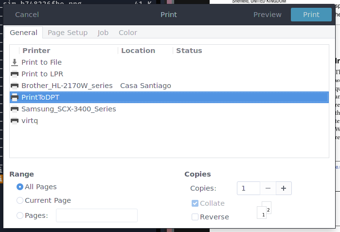

# Virtual printer for Sony digital paper (DPT-RP1) using tea4cups

A simple virtual printer that prints directly to your Sony DPT-RP1 through wifi or bluetooth.

## Requirements

This virtual printer requires the following programs to work:
* [Tea4CUPS](http://www.pykota.com/software/tea4cups)
* [dpt-rp1-py](https://github.com/janten/dpt-rp1-py)

## Installation

First you need to edit the file `config.conf` and add the wifi/bluetooth address and full paths to your "deviceid" and "privatekey" files (these are the same files needed by dpt-rp1-py, so make sure you have correctly configured that first).

```
address=192.168.1.100
client=/full/path/to/deviceid.dat
key=/full/path/to/.dpapp/privatekey.dat
```

In the same file you can define a name for the virtual printer setting the variable `printername` (defaults to "PrintToDPT").


Then configure it with
```
make configure
```

And install the virtual printer with
```
sudo make install
```

You can now find your new virtual printer listed in the print dialog.
Done.



## Issues

At the time, it is only possible to configure _one_ DPT-RP1 device, as the "deviceid" and "privatekey" files are copied to the installation directory.
This is so, because I don't know how to make a program executed by CUPS to have read access to the files in the user `$HOME` directory.
If you know how to do this, please open an issue or a PR.
