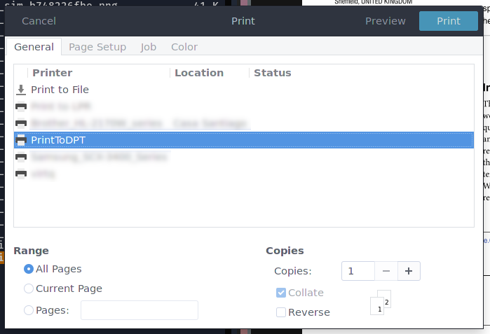

# Virtual printer for Sony digital paper (DPT-RP1)

_This repository has been archieved. I made a new implementation in [dptrp1-cups](https://github.com/cristobaltapia/dptrp1-cups)_

A simple virtual printer that prints directly to your Sony DPT-RP1 through wifi or bluetooth.

## Requirements

This virtual printer requires the following programs to work:
* [Tea4CUPS](http://www.pykota.com/software/tea4cups)
* [dpt-rp1-py](https://github.com/janten/dpt-rp1-py)

## Installation

Install the virtual printer with
```
sudo make install
```

You can now find your new virtual printer listed in the print dialog.



## Configuration

First you need to create a configuration file `config.conf` under `$XDG_CONFIG_HOME/dpt-virtual-printer/` and add the wifi/bluetooth address and full paths to your "deviceid" and "privatekey" files (these are the same files needed by dpt-rp1-py, so make sure you have correctly configured that first).

```
dptaddr=192.168.1.100
deviceid=/full/path/to/deviceid.dat
devicekey=/full/path/to/privatekey.dat
```

In the same file you can define the path to the location of the script `dptrp1` (defaults to `/usr/local/bin/dptrp1`)
```
dptrp1=/usr/local/bin/dptrp1
```

Done.
